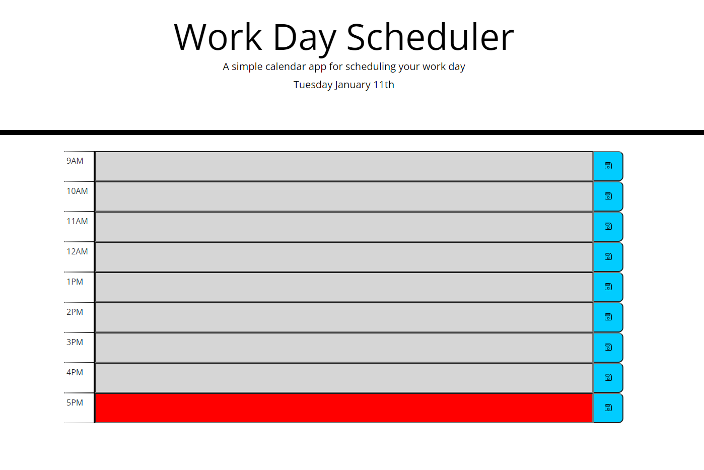
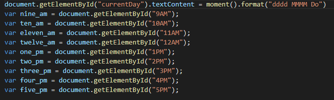
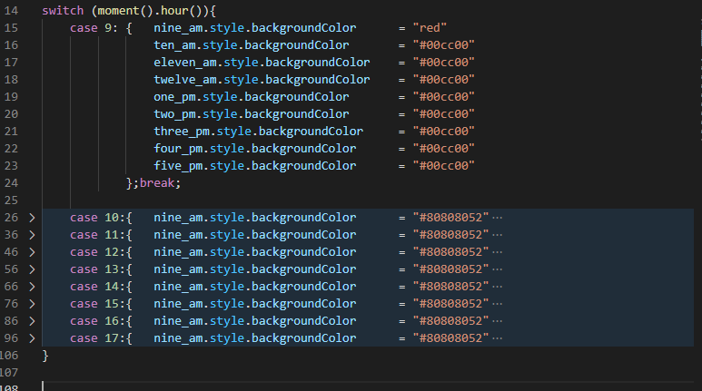
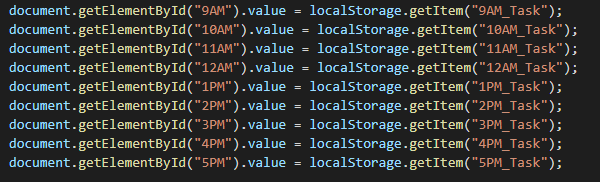
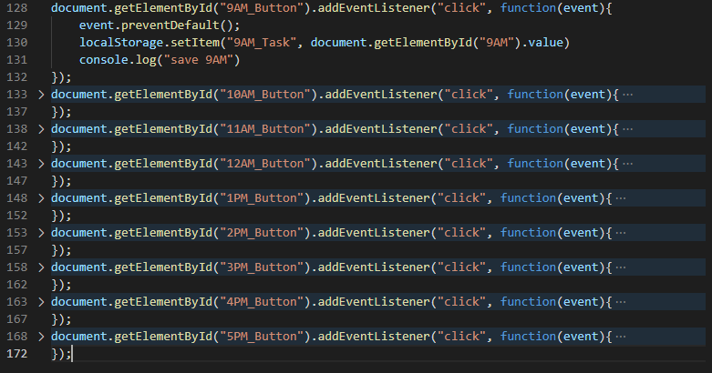

# 05 Third-Party APIs: Work Day Scheduler
[Link to the live page](https://clabel95.github.io/05-Third-Party-APIs-Homework/)


[Link to the github repository](https://github.com/clabel95/05-Third-Party-APIs-Homework)

## My task

Create a simple calendar application that allows a user to save events for each hour of the day by modifying starter code. This app will run in the browser and feature dynamically updated HTML and CSS powered by jQuery.


## Features

```md
- date at top of page
- timeblocks for every hour from 9AM to 5PM
- timeblocks backgrounds update dynamicly depending on the current time.
    - green for future
    - red for current
    - gray for past
- save button to the right of each timeblock
    - save button stores the contents of the corosponding time block in local storage
    - this saved data will persist between page refreshes
```



## Code

The javascript consists of four parts.

Part one is where I defined all the variables that I would need as well as using moment.js to add the date to the top of the page.



Part two is how I dynamicly change the background color of the timeblocks. I set up a switch case statement with the switching argument as the current hour of the day. I then set up the cases as the corosponding hours from 9 to 17. Inside the case statement I set the background color for every timeblock. Looking back it might have taken less code if I had just used a for loop and with three if statments inside checking for if the time was less than equal to or greater than the current hour. However I also like how clean switch statements are so for now I will leave it. 



Part three is where I set up the local storage for the webpage so that if anything was saved in local storage then on page refresh it would be pulled back into the corosponding timeblock.



Part four is where I set up the event listeners for each save button. Inside the event listeners I am saving whatever was in the text box to local storage. 




